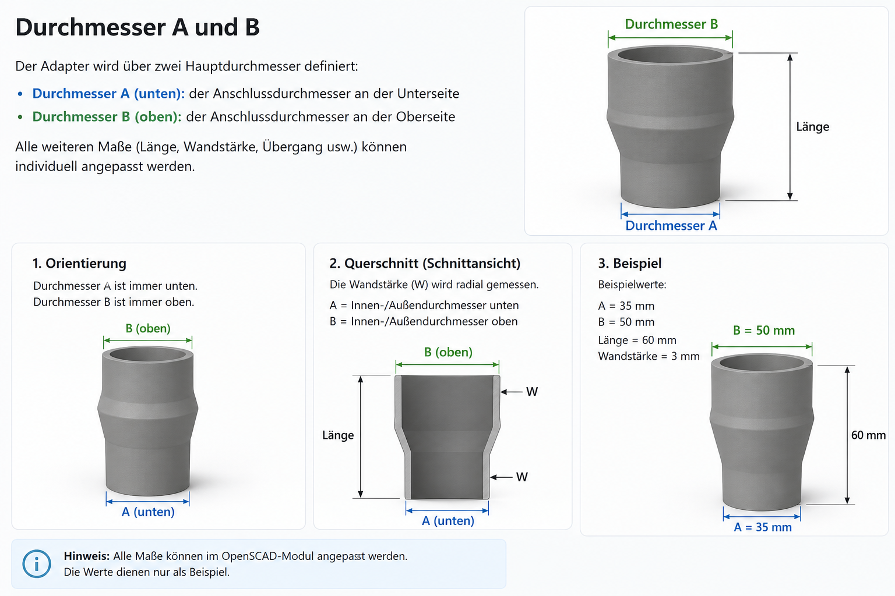

# Parametric Tube & Adapter Generator

Ein parametrischer OpenSCAD-Generator für Rohradapter, Schlauchverbinder, Reduzierungen und andere technische Verbindungsteile.

Dieses Projekt wurde entwickelt, um individuelle Adapter schnell und einfach zu erstellen, ohne jedes Modell neu konstruieren zu müssen. Alle wichtigen Maße können direkt über Parameter in OpenSCAD angepasst werden.

## Funktionen

* Einstellbarer Durchmesser A und Durchmesser B
* Gerade und konische Adapter
* Anpassbare Wandstärke
* Frei wählbare Länge
* Vollständig parametrischer Aufbau
* STL-Export für den 3D-Druck
* Geeignet für funktionale Bauteile und Prototypen

## Durchmesser A und B

Der **Durchmesser A** befindet sich immer auf der Unterseite des Adapters.

Der **Durchmesser B** befindet sich immer auf der Oberseite des Adapters.

Dadurch lassen sich Übergänge zwischen unterschiedlichen Rohr-, Schlauch- oder Anschlussdurchmessern einfach erzeugen.

### Beispiel

* Durchmesser A = 35 mm
* Durchmesser B = 50 mm
* Länge = 60 mm

Ergebnis: Ein konischer Adapter von 35 mm auf 50 mm.

## Mögliche Anwendungsbereiche

* Staubsaugeradapter
* Schlauchverbinder
* Rohrreduzierungen
* Werkstatt- und Maschinenanschlüsse
* Technische Prototypen
* Individuelle Ersatzteile
* Allgemeine Rohr- und Verbindungssysteme

## Verwendete Software

* OpenSCAD

## Projektstatus

Das Projekt wird aktiv weiterentwickelt. Geplant sind zusätzliche Funktionen, weitere Adaptertypen und eine verbesserte Dokumentation.

## Lizenz

MIT License
